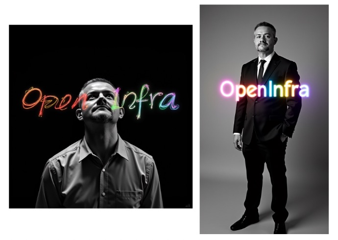

# Low Rank Adaptation (LoRA) - "Tokman"

The content below is refering to the LoRA training blog post: https://www.gkr.one/blg-20240818-flux-lora-training

The blog post outlines a method to train LoRA (Low-Rank Adaptation) modules for the FLUX.1-Dev and FLUX.1-Schnell image generation models using a 24 GB GPU and using ComfyUI for inference.

## Goals

- The aim is to allow users to fine-tune (via LoRA) FLUX.1 models on their own images so they can later generate new images that reflect the style or subject present in the training set.
- The procedure relies on the [ai-toolkit](https://github.com/ostris/ai-toolkit) repository (on GitHub) to carry out the training pipeline.
- The guide supports both the Dev and Schnell versions of FLUX.1, each with its own configuration differences.

## Requirements

- A NVIDIA GPU with ≥ 24 GB VRAM.
- Ubuntu 24.04 (or compatible setup), plus standard tools (git, Python 3.12, pip, venv).
- A Hugging Face token to access FLUX.1 weights and related resources.
- Training images in .jpg or .png format (recommended 1024×1024), each paired with a .txt file containing prompt(s).

## Training notes

When training a LoRA, you usually pick a unique token (like tok, zzzperson, or myStyle123) that doesn’t exist in the model’s vocabulary. This token is injected into the text prompts during training and becomes associated with the subject/style in your dataset.

We will train on 4,000 steps.

On an Nvidia RTX 4090, this training took about 140 minutes on 25 input images.

The final LoRA weight file (`flux_dev-tok.safetensors`) is about 200MB.

## Usage

Grab amd drop the `tokman_basicFlux_workflow-ex1.json` file into onto the ComfyUI WebUI, this will load the workflow.

The workflow is a basic workflow that will generate an image using the LoRA weight file. Muliple components for image generation are present:
| Component	| Role | Analogy |
| --- | --- | --- |
| 🧠 Model	| Core generator turning text into images	| 🎨 Painter |
| 📖 CLIP	| Encodes text into concepts the model understands	| 🗣️ Translator |
| 🧩 LoRA	| Adds new styles or knowledge to the base model	| 🧰 Custom brush |
| 🔄 Sampler	| Algorithm that refines noise into the image	| 🔄 Painting technique |
| 🌌 Latent	| Compressed internal image representation	| 📐 Blueprint |
| 🖼️ VAE	| Converts latent image to actual pixels	| 🖨️ Printer |

- 🧠 Model — the “brain” of image generation. 
  The main neural network (e.g., stable-diffusion-v1-5, SDXL, FLUX, etc.) trained to turn text into images.
  It learns the relationship between words and images and is responsible for generating the image structure, composition, and details.

- 📖 CLIP — the “translator” of text to concepts. 
  A text encoder that converts prompts into a vector representation the diffusion model understands.
  It doesn’t generate the image but tells the model what concepts and styles to focus on.

- 🧩 LoRA — the “add-on” for new styles or subjects. 
  Short for Low-Rank Adaptation, a lightweight fine-tuning file that modifies a base model without retraining it.
  Adds new styles, characters, objects, or aesthetics on top of an existing model.
  Example: A LoRA trained on Van Gogh paintings makes any image adopt that style when activated.

- 🔄 Sampler — the “rendering process”. 
  The algorithm that iteratively refines random noise into a final image based on your prompt and model.
  Different samplers change image speed, detail, smoothness, and style.

- 🌌 Latent — the “hidden image space”. 
  The compressed, abstract representation of the image inside the model’s hidden layers.
  Stable Diffusion doesn’t generate pixels directly — it works in latent space (a smaller, efficient representation), then converts it into a visible image later.

- 🖼️ VAE — the “decoder” that turns abstract data into pixels. 
  The Variational Autoencoder — a neural network that encodes images into latent space and decodes them back into real pixel space.
  At the end of the generation process, the VAE translates the latent image into a visible PNG/JPG.

This workflow does not require any special nodes, but will require a set of weights to be placed in various `basedir/models` folders.

In ComfyUI, everything revolves around nodes — modular building blocks that each perform a specific task in the AI image generation pipeline. By connecting these nodes visually, a graph is formed, and the data flows from one to another, creating a flexible, customizable workflow. Nodes are linked in a pipeline: "Prompt ➝ Encode ➝ Model ➝ Noise ➝ Sampler ➝ Decode ➝ Output"

The weights are:
- From https://huggingface.co/black-forest-labs/FLUX.1-dev/tree/main
  - `flux1-dev.safetensors`, to be placed into `basedir/models/diffusion_models` (23GB)
  - `ae.safetensors`, to be placed into `basedir/models/vae` (320MB)
- From https://huggingface.co/comfyanonymous/flux_text_encoders/tree/main
  - `t5xxl_fp16.safetensors`, to be placed into `basedir/models/clip` (9GB)
  - `clip_l.safetensors`, to be placed into `basedir/models/clip` (200MB)
- The generated LoRA weight file (`flux_dev-tok.safetensors`) to be placed into `basedir/models/lora` (200MB)

The workflow is a basic workflow that will generate an image using the LoRA weight file.

You can alter the prompt or the resolution to generate different images, as shown in the `tokman_basicFlux_workflow-ex2.json` file.

