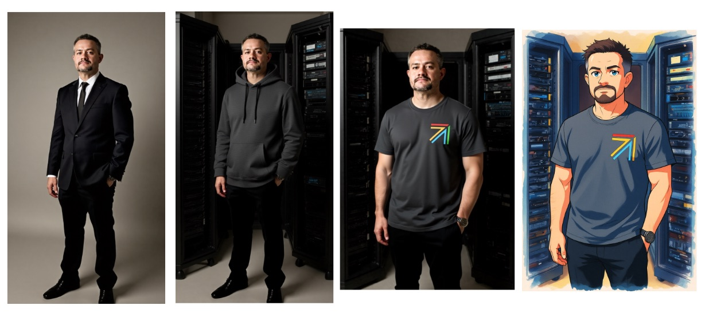

# Flux Kontext

We will use one of ComfyUI's embedded workflows, which makes use of [`fp8` weights](https://en.wikipedia.org/wiki/Half-precision_floating-point_format).

[“Flux Kontext”](https://bfl.ai/models/flux-kontext) (also written FLUX Kontext or FLUX.1 Kontext) is a multimodal image model suite from Black Forest Labs that unifies image editing and image generation under one architecture.  

FLUX Kontext can perform:

- In-Context Image Editing + Generation: Supply both an image and a text instruction, and FLUX Kontext will interpret the existing scene and apply the edit requested.
- Local Edits & Global Edits: Supports targeted modifications — e.g. change hair color, remove an object, add something — while leaving the rest of the image intact. At the same time, it can transform whole scenes, styles, or layouts.
- Character/Object Consistency Across Edits: A key advantage is that repeated edits (across multiple steps) preserve identity, style, and composition, reducing visual drift (i.e. the character doesn’t change form drastically over successive edits).

It is [integrated into ComfyUI](https://docs.comfy.org/tutorials/flux/flux-1-kontext-dev), and is accessible via APIs.

## Usage

Additional needed weights:

- [t5xxl_fp8_e4m3fn_scaled.safetensors](https://huggingface.co/comfyanonymous/flux_text_encoders/resolve/main/t5xxl_fp8_e4m3fn_scaled.safetensors) to be placed into `basedir/models/text_encoders` (4.8GB)
- [flux1-dev-kontext_fp8_scaled.safetensors](https://huggingface.co/Comfy-Org/flux1-kontext-dev_ComfyUI/resolve/main/split_files/diffusion_models/flux1-dev-kontext_fp8_scaled.safetensors) to be placed in `basedir/models/diffusion_models` (11GB)

For the following steps:

- Grab and drop the mentioned example file (ex: `fluxkontext-ex01.json`) onto the ComfyUI WebUI, this will load the workflow.
- Make sure to use the previous image generated as the input image (or bring your own image).
- Each workflow and prompt (in the `Step 3 - Prompt` node) demonstrates a different use case.

Each file is based on the same base workflow but provides different applications of the model:

- `fluxkontext-ex01.json` : text removal + re-color black and white source
- `fluxkontext-ex02.json` : background addition + outfit change
- `fluxkontext-ex03.json` : outfit change + add the OpenInfra logo (second image) on the outfit
- `fluxkontext-ex04.json` : style change

